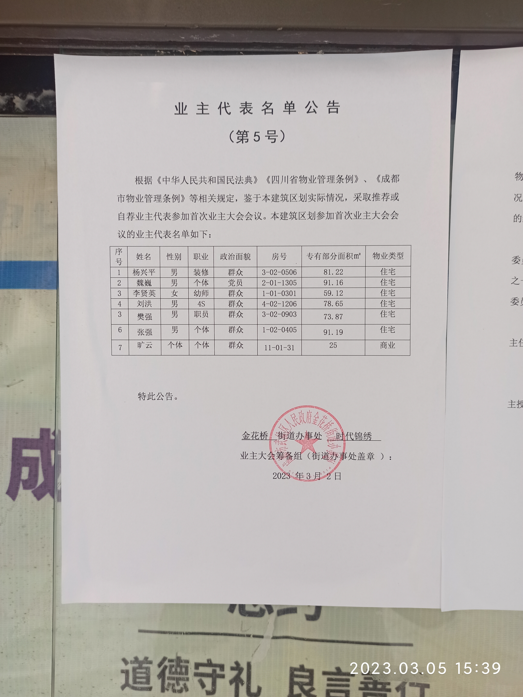
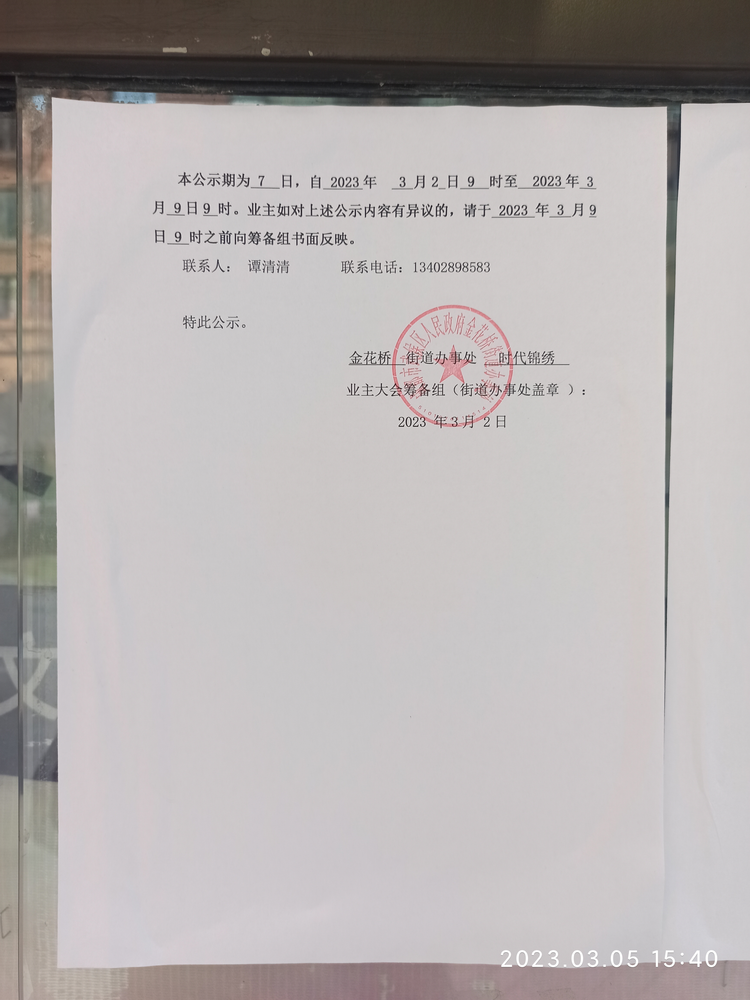

尊敬的人民政府与住建主管部门领导：

成都市武侯区金花桥街道时代锦绣小区（武侯大道文昌段55号），近期因业主大会筹备组（以下简称筹备组）的违规活动与街道办事处的工作不力，致使全体业主权益受到侵害。恳请您部门依法取缔违规组织、撤销违规决定，保障群众合法权益。具体情况如下：

## 1、违规指定业主大会会议形式

筹备组第5号公告，擅自决定由7名不明人员代表业主召开业主大会会议，违反了国务院《物业管理条例》第十二条，违反了《四川省物业管理条例》第二十三条的规定。损害了全体业主的权利，造成公共权利被私用的严重风险。

《物业管理条例》第十二条:

    第十二条　业主大会会议可以采用集体讨论的形式，也可以采用书面征求意见的形式；但是，应当有物业管理区域内专有部分占建筑物总面积过半数的业主且占总人数过半数的业主参加。

    业主可以委托代理人参加业主大会会议。

    业主大会决定本条例第十一条第(五)项和第(六)项规定的事项，应当经专有部分占建筑物总面积2/3以上的业主且占总人数2/3以上的业主同意；决定本条例第十一条规定的其他事项，应当经专有部分占建筑物总面积过半数的业主且占总人数过半数的业主同意。

    业主大会或者业主委员会的决定，对业主具有约束力。

    业主大会或者业主委员会作出的决定侵害业主合法权益的，受侵害的业主可以请求人民法院予以撤销。

《四川省物业管理条例》第二十三条:

    第二十三条  业主可以委托他人参加业主大会会议。被委托人应当提供委托人和本人身份证明材料、委托人签署的授权委托书、委托人不动产产权证明的复制件，按照受委托事项、时间、权限，代表业主行使权利。

## 2、违规制定业主委员会组成及其候选人条件，同时排除业主议事权利

筹备组在第6号公告中，拟定了的业主委员会组成及其候选人条件，但并未征求业主的意见，未取得业主的共同决定。违反了国务院《物业管理条例》第十一条第一项、第十八条，《四川省物业管理条例》第十九条第一项、第二十二条的规定。同时该公告表示业主意见需要采取书面形式表达，但公告中并不提供其接受业主书面意见的方式，阻碍业主参与议事，严重侵害了业主权利。

《物业管理条例》第十一条:

    第十一条　下列事项由业主共同决定：

    (一)制定和修改业主大会议事规则；

    (二)制定和修改管理规约；

    (三)选举业主委员会或者更换业主委员会成员；

    (四)选聘和解聘物业服务企业；

    (五)筹集和使用专项维修资金；

    (六)改建、重建建筑物及其附属设施；

    (七)有关共有和共同管理权利的其他重大事项。

《物业管理条例》第十八条:

    第十八条　业主大会议事规则应当就业主大会的议事方式、表决程序、业主委员会的组成和成员任期等事项作出约定。

《四川省物业管理条例》第十九条:

    第十九条  下列事项由业主共同决定：

    （一）制定和修改业主大会议事规则；

    （二）制定和修改管理规约；

    （三）选举业主委员会或者更换业主委员会成员；

    （四）选聘和解聘物业服务人；

    （五）使用建筑物及其附属设施的维修资金；

    （六）筹集建筑物及其附属设施的维修资金；

    （七）改建、重建建筑物及其附属设施；

    （八）改变共有部分的用途或者利用共有部分从事经营活动；

    （九）在物业服务区域公共空间安装个人身份和生物特征识别设备；

    （十）物业服务区域划分与调整；

    （十一）实施自行管理；

    （十二）物业费调整；

    （十三）设立业主代表大会以及确定其职责；

    （十四）有关共有和共同管理权利的其他重大事项。

    提交业主共同决定的事项，应当尊重社会公德，不得违反法律、法规的规定和损害社会公共利益

《四川省物业管理条例》第二十二条:

    第二十二条  业主大会议事规则应当包含以下事项：

    （一）业主大会的议事方式、表决程序；

    （二）业主委员会的组成、职责、届期、工作经费及其开支范围和开支金额、成员工作补贴标准和任职条件及资格终止情形、设立候补委员的规定；

    （三）业主大会和业主委员会印章、业主共有资金账户的使用和管理；

    （四）业主委员会换届；

    （五）其他事项。

    制定业主大会议事规则，不得违反法律、法规的规定。

## 3、未依法拟定并公示业主大会议事规则与管理规约草案，拒绝接收业主讨论意见

筹备组自成立之日起，未依法拟定《业主大会议事规则》、《管理规约》的草案，未依法公告业主大会召开日期，未依法明确投票表决机制。自始至终暗巷操作业主大会的筹备与业主委员会的组建事宜。违背物业管理业主自治的初衷，违反法律法规的约定，侵害业主的合法权益。
另外，筹备组在所有公告中皆未公告书面接受业主议事意见的方式（邮寄地址与电子邮箱地址），街道办没有对筹备组处理业主意见的有效监督，筹备组没有定期公布业主意见的收集与处理情况，缺乏公开透明的组织形式。

## 4、金花桥街道办事处对违规侵权负有监督管理责任

小区所在的金花桥街道办事处监督缺位，致使筹备组的活动缺乏有效监督，违规行为持续发生；业务不精，允许明显不合规的公告发出；责任缺失，致使辖区群众的权益收到侵害，需要提高相关人员的业务水平。